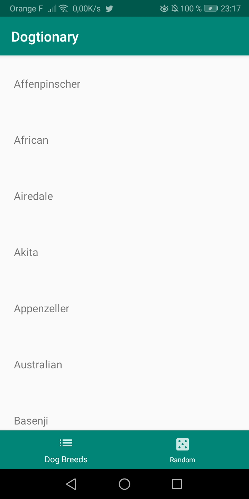
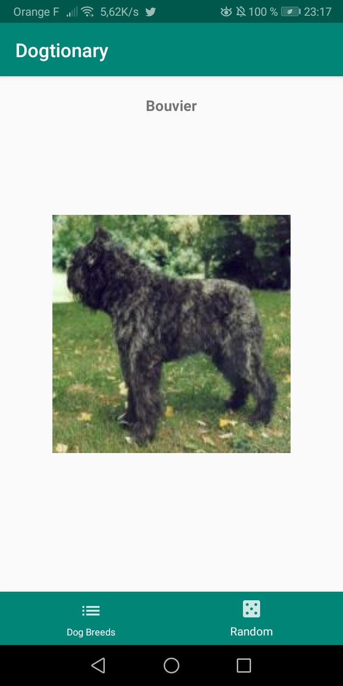
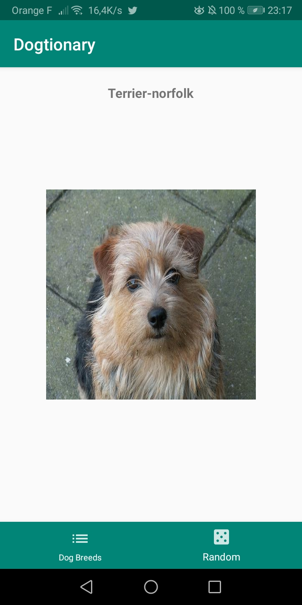

# Dogtionnary
Mobile Application listing dog breeds from Dog API

 ## Présentation

 Simple projet démontrant l'utilisation du pattern MVC dans une application Android codée en Java.

 Cette application affiche les informations tirés de l'API Rest ([Dog API](https://dog.ceo/dog-api/documentation/)).

 ## Prérequis


- Installation d'Android Studio
- Cloner la branche master avec le lien ci-dessous : <br/>

````
git clone https://github.com/ChasleL/Dogtionnary.git
````

 ## Consignes respectées : 

- Architecture MVC
- Appels API Rest
- Ecrans : 2 écrans
- Affichage d'une liste dans un RecyclerView
- Utilisation de plusieurs fragments
- Git
- Design Pattern : Singleton, Adapter
- Material Bottom Navigation Bar


 ## Fonctionnalités: 

 ### Ecran Home 

 - Affiche la liste de tous les races de chiens.

 

 ### Ecran du l'affichage au hasard d'une image de chien

 - Affichage d'une image aléatoire de chien à travers les données d'un URL.


  
 
 ### Librairies :
 - Retrofit
 - Picasso
 - Gson
 - RecyclerView
 - Fragment
 - Design
